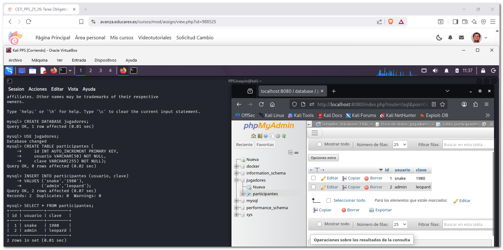
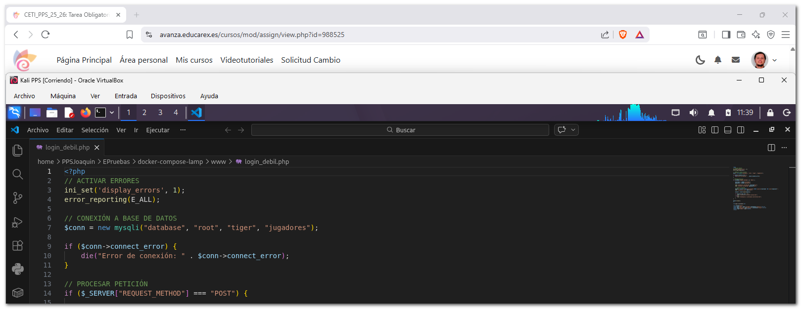
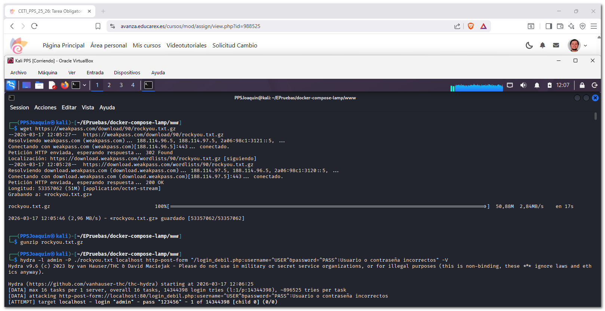
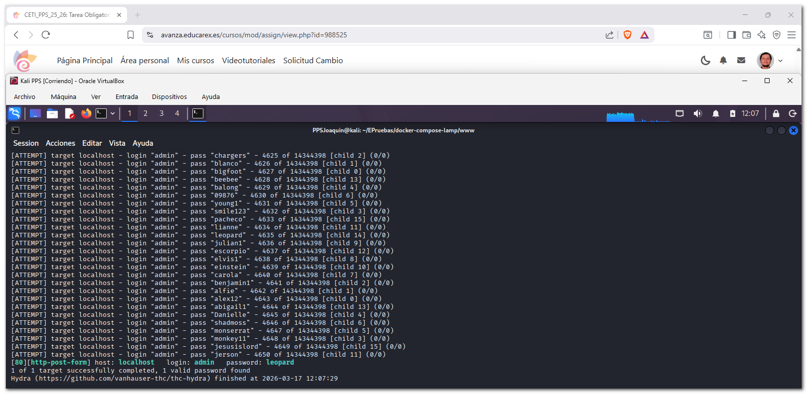
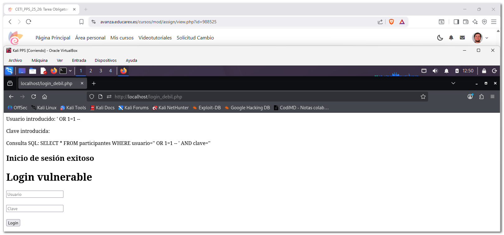
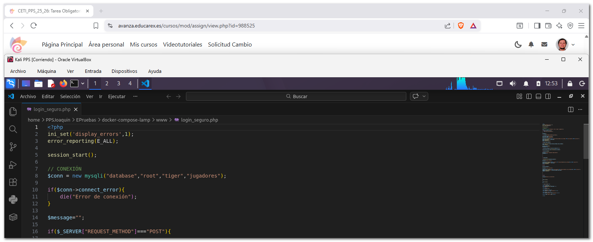
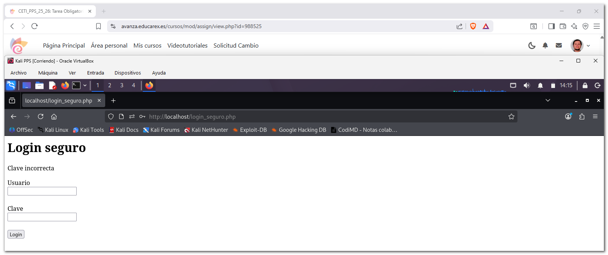
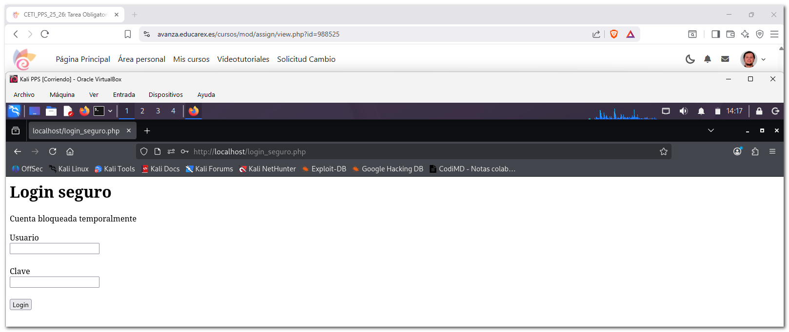
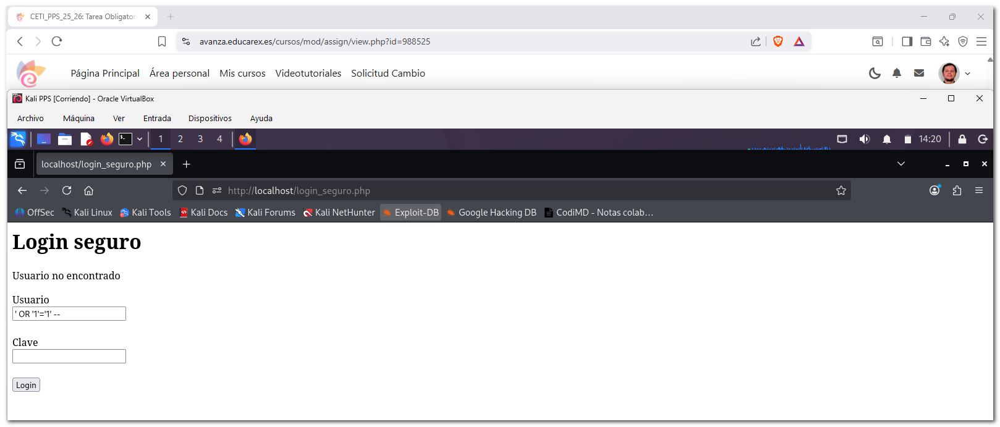

# 2. Documentación de autenticación, vulnerabilidades de gestión de sesiones, protección de datos sensibles o Control de acceso

En esta sección se analiza una vulnerabilidad de autenticación débil **(Broken Authentication)** presente en una aplicación web desarrollada en PHP.  

Se muestra:  

- El **código vulnerable del sistema de autenticación**.
- La **explotación mediante ataques de fuerza bruta**.
- La **implementación de mitigaciones de seguridad**.
- Una **batería de pruebas** para verificar las soluciones aplicadas.

---

## 2.1 Base de datos y código vulnerable

### Creación base de datos

Primero creo la base de datos `jugadores` con la tabla `participantes` e inserto datos en las filas de `usuario` y `clave`.



```sql
CREATE DATABASE jugadores;
USE jugadores;

CREATE TABLE participantes (
    id INT AUTO_INCREMENT PRIMARY KEY,
    usuario VARCHAR(50) NOT NULL,
    clave VARCHAR(255) NOT NULL);

INSERT INTO participantes (usuario, clave)
VALUES ('snake','1980'),
       ('admin','leopard');
```
---

### Código vulnerable

Muestra del código vulnerable.



La aplicación utiliza el archivo login_debil.php para autenticar a los usuarios, este sistema presenta varias vulnerabilidades de seguridad relacionadas con la autenticación.


**`login_debil.php`**

```php
<?php
// ACTIVAR ERRORES
ini_set('display_errors', 1);
error_reporting(E_ALL);

// CONEXIÓN A BASE DE DATOS
$conn = new mysqli("database", "root", "tiger", "jugadores");

if ($conn->connect_error) {
    die("Error de conexión: " . $conn->connect_error);
}

// PROCESAR PETICIÓN
if ($_SERVER["REQUEST_METHOD"] === "POST") {

    $username = $_POST["username"];
    $password = $_POST["password"];

    echo "<p>Usuario introducido: $username</p>";
    echo "<p>Clave introducida: $password</p>";

    // CONSULTA INSEGURA
    $query = "SELECT * FROM participantes WHERE usuario='$username' AND clave='$password'";
    echo "<p>Consulta SQL: $query</p>";

    $result = $conn->query($query);

    if ($result->num_rows > 0) {
        echo "<h2>Inicio de sesión exitoso</h2>";
    } else {
        echo "<h2>Usuario o contraseña incorrectos</h2>";
    }
}

$conn->close();
?>

<h1>Login vulnerable</h1>

<form method="post">
<input type="text" name="username" placeholder="Usuario"><br><br>
<input type="password" name="password" placeholder="Clave"><br><br>
<button type="submit">Login</button>
</form>
```

**Explicación de las vulnerabilidades**  

Este sistema tiene varios problemas:  

- **Contraseñas en texto plano**, en la base de datos se guardan así: `snake | 1980`.
- **SQL Injection**, la consulta usa variables directamente: `$query = "SELECT * FROM usuarios WHERE usuario='$username' AND clave='$password'";`, un atacante puede introducir `' OR '1'='1`.
- **Sin protección contra fuerza bruta**, el sistema permite infinitos intentos de login.

---

## 2.2 Explotación, ataque de fuerza bruta con Hydra e inyección SQL

### Hydra

Cuando ejecuto Hydra desde la terminal de mi máquina atacante, mientras se está ejecutando:

- Hydra envía miles de peticiones POST.
- La web las procesa automáticamente.
- No necesita mi intervención en el formulario.




Como podemos observar después de ejecutar la herramienta Hydra encuentra la clave en la linea: `[80][http-post-form] host: localhost   login: admin   password: leopard`.  

---

### Inyección SQL

Introduzco `' OR '1'='1' --`:

- `'` cierra la cadena original del campo usuario.
- `OR '1'='1'` añade una condición siempre verdadera.
- `--` comenta el resto de la consulta (ignora la contraseña).



---

## 2.3 Mitigación

Muestra del código modíficado con las mitigaciones aplicadas.



**`login_seguro.php`**

```php
<?php
ini_set('display_errors',1);
error_reporting(E_ALL);

session_start();

// CONEXIÓN
$conn = new mysqli("database","root","tiger","jugadores");

if($conn->connect_error){
    die("Error de conexión");
}

$message="";

if($_SERVER["REQUEST_METHOD"]==="POST"){

$username=$_POST["username"];
$password=$_POST["password"];

$stmt=$conn->prepare("SELECT clave,failed_attempts,last_attempt FROM participantes WHERE usuario=?");
$stmt->bind_param("s",$username);
$stmt->execute();
$stmt->store_result();

if($stmt->num_rows>0){

$stmt->bind_result($hash,$failed_attempts,$last_attempt);
$stmt->fetch();

$current_time=time();
$blocked=false;

if($failed_attempts>=3 && $last_attempt!=NULL){

$interval=$current_time-strtotime($last_attempt);

if($interval<900){

$message="Cuenta bloqueada temporalmente";
$blocked=true;

}

}

if(!$blocked){

if(password_verify($password,$hash)){

$message="Login correcto";

$reset=$conn->prepare("UPDATE usuarios SET failed_attempts=0,last_attempt=NULL WHERE usuario=?");
$reset->bind_param("s",$username);
$reset->execute();

}else{

$failed_attempts++;

$message="Clave incorrecta";

$update=$conn->prepare("UPDATE participantes SET failed_attempts=?,last_attempt=NOW() WHERE usuario=?");
$update->bind_param("is",$failed_attempts,$username);
$update->execute();

}

}

}else{

$message="Usuario no encontrado";

}

$stmt->close();
}

$conn->close();
?>

<h1>Login seguro</h1>

<?php if($message): ?>
<p><?=htmlspecialchars($message)?></p>
<?php endif; ?>

<form method="post">

<label>Usuario</label><br>
<input type="text" name="username"><br><br>

<label>Clave</label><br>
<input type="password" name="password"><br><br>

<button type="submit">Login</button>

</form>
```

Además hay que agregar las siguientes tablas `failed_attempts` y ` last_attempt` a la bd para que el login seguro funcione:

```sql
ALTER TABLE participantes 
ADD failed_attempts INT DEFAULT 0,
ADD last_attempt DATETIME NULL;
```

---


### Mitigación 1 - Uso de contraseñas hasheadas

Código aplicado:

```php
$hash = password_hash($password, PASSWORD_DEFAULT);
```
Explicación:

Esto evita almacenar contraseñas en texto plano.

---

### Mitigación 2 - Consultas preparadas

Código aplicado:

```php
$stmt = $conn->prepare("SELECT contrasenya,failed_attempts,last_attempt FROM usuarios WHERE usuario=?");
$stmt->bind_param("s", $username);
$stmt->execute();
```
Explicación:

Evita ataques de inyección SQL.

---

### Mitigación 3 - Bloqueo de ataques de fuerza bruta y diccionarios

**Comprobar intentos fallidos**

Código aplicado:

```php
if($failed_attempts >= 3 && $last_attempt != NULL){);
```
Explicación:

Si hay 3 o más intentos, posible bloqueo.

**Calcular tiempo desde el último intento**

Código aplicado:

```php
$current_time = time();
$interval = $current_time - strtotime($last_attempt);
```
Explicación:

Convierte la fecha de BD a timestamp y calcula diferencia.

**Bloquear durante 15 minutos (900 segundos)**

Código aplicado:

```php
if($interval < 900){
    $message = "Cuenta bloqueada temporalmente";
    $blocked = true;
}
```
Explicación:

Si no han pasado 15 min, cuenta bloqueada.

**Si no está bloqueado verificar contraseña**

Código aplicado:

```php
if(!$blocked){
```
Explicación:

- **Caso 1:** Login correcto

```php
if(password_verify($password, $hash)){
```

Si la contraseña es correcta, reinicia contador y quita bloqueo.  

```php
$reset = $conn->prepare("UPDATE usuarios SET failed_attempts=0,last_attempt=NULL WHERE usuario=?");
```

- **Caso 2:** Login incorrecto  

```php
$failed_attempts++;
```

Suma un intento fallido y guarda número de intentos con hora del intento.

```php
$update = $conn->prepare("UPDATE usuarios SET failed_attempts=?, last_attempt=NOW() WHERE usuario=?");
```

---

## 2.4 Creación segura de usuarios

Para poder utilizar el sistema de autenticación seguro es necesario almacenar las contraseñas utilizando hash criptográfico en lugar de texto plano. 

Para ello se ha desarrollado el archivo `agregar_usuario.php`, que permite registrar nuevos usuarios utilizando la función `password_hash()` de PHP. Esta función genera un hash seguro utilizando el algoritmo **bcrypt**, lo que impide recuperar la contraseña original incluso si un atacante accede a la base de datos.


**`agregar_usuario.php`**

```php
<?php

// ACTIVAR ERRORES
ini_set('display_errors',1);
error_reporting(E_ALL);

// CONEXIÓN A LA BASE DE DATOS
$conn = new mysqli("database","root","tiger","jugadores");

if($conn->connect_error){
    die("Error de conexión: ".$conn->connect_error);
}

$message="";

// CREAR USUARIO
if($_SERVER["REQUEST_METHOD"]==="POST"){

$username = trim($_POST["username"]);
$password = $_POST["password"];

if($username!=="" && $password!==""){

// GENERAR HASH DE CONTRASEÑA
$hash = password_hash($password, PASSWORD_DEFAULT);

// CONSULTA PREPARADA
$stmt = $conn->prepare("INSERT INTO participantes (usuario, clave) VALUES (?,?)");

$stmt->bind_param("ss",$username,$hash);

if($stmt->execute()){

$message="Usuario creado correctamente";

}else{

$message="Error al crear usuario";

}

$stmt->close();

}else{

$message="Debe introducir usuario y contraseña";

}

}

$conn->close();
?>

<!DOCTYPE html>
<html>
<head>
<meta charset="UTF-8">
<title>Crear usuario</title>
</head>

<body>

<h1>Registro de usuario</h1>

<?php if($message): ?>
<p><?=htmlspecialchars($message)?></p>
<?php endif; ?>

<form method="post">

<label>Usuario</label><br>
<input type="text" name="username"><br><br>

<label>Clave</label><br>
<input type="password" name="password"><br><br>

<button type="submit">Crear usuario</button>

</form>

</body>
</html>
```

Prueba creación nuevo usuario:


---

## 2.5 Batería de pruebas

Tras aplicar las mitigaciones se realizaron varias pruebas para comprobar el comportamiento de la aplicación.

**Prueba 1 - Contraseña incorrecta**

 - Objetivo de la prueba: verificar que el sistema detecta credenciales incorrectas.
 - Resultado esperado: el sistema debe mostrar el mensaje "Contraseña incorrecta" y registrar el intento fallido.
 - Resultado observado: la aplicación muestra el mensaje correctamente y aumenta el contador de intentos fallidos.



---

**Prueba 2 - Bloqueo de cuenta por intentos fallidos**

 - Objetivo de la prueba: comprobar que el sistema bloquea temporalmente la cuenta tras varios intentos fallidos..
 - Resultado esperado: el sistema debe bloquear la cuenta durante 15 minutos y mostrar el mensaje "Cuenta bloqueada temporalmente".
 - Resultado observado: la cuenta queda bloqueada correctamente tras los intentos fallidos y se muestra el mensaje esperado.



---

**Prueba 3 - Intento de SQL Injection**

Payload: `' OR '1'='1' --`.

 - Objetivo de la prueba: comprobar que el sistema es resistente a ataques de inyección SQL.
 - Resultado esperado: el sistema no debe permitir el acceso y debe tratar la entrada como un valor literal.
 - Resultado observado: el acceso es rechazado correctamente y no se produce la inyección SQL.



---

**Prueba 4 - Intento de acceso durante el bloqueo**

Acción realizada: intentar iniciar sesión con la contraseña correcta después de que la cuenta haya sido bloqueada.

 - Objetivo de la prueba: verificar que el bloqueo se aplica incluso con credenciales válidas.
 - Resultado esperado: el sistema debe impedir el acceso y mostrar el mensaje de cuenta bloqueada.
 - Resultado observado: el acceso es rechazado correctamente mientras dura el periodo de bloqueo.


---


