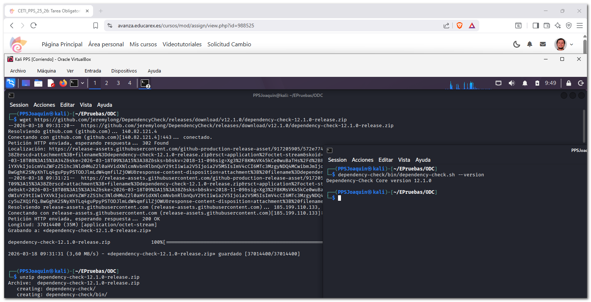
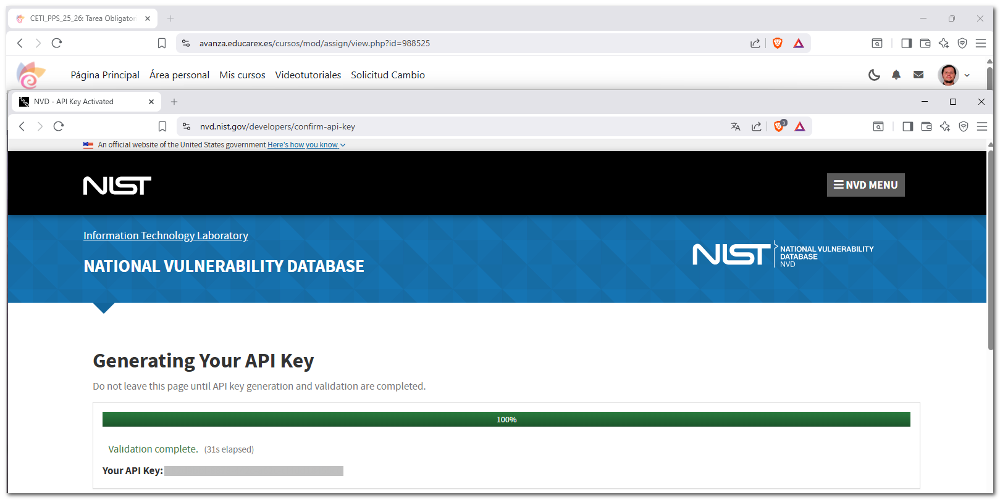
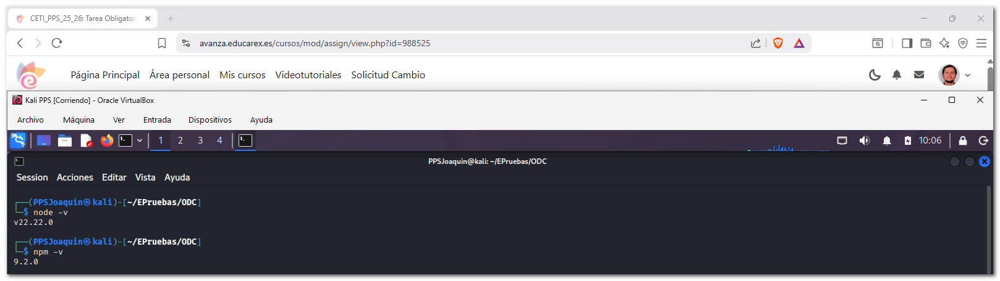
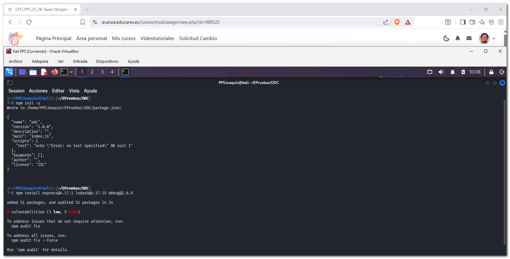
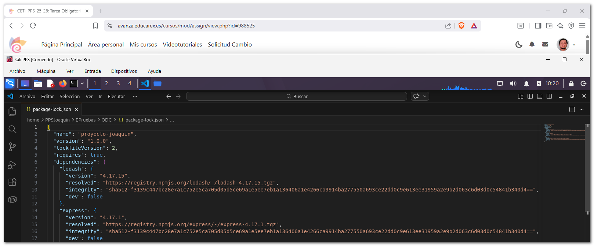
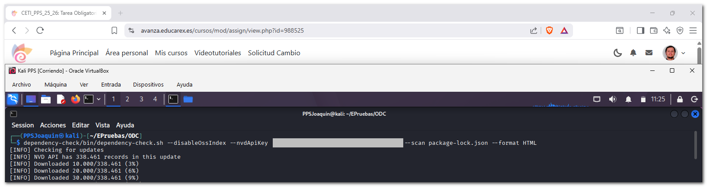
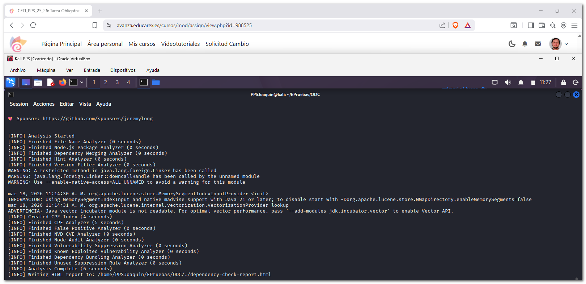
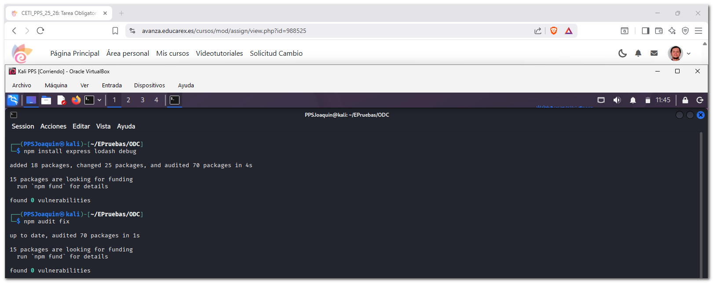
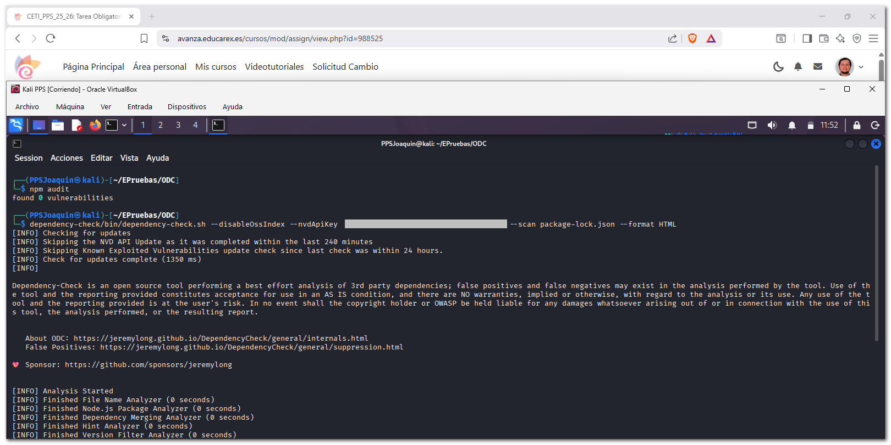
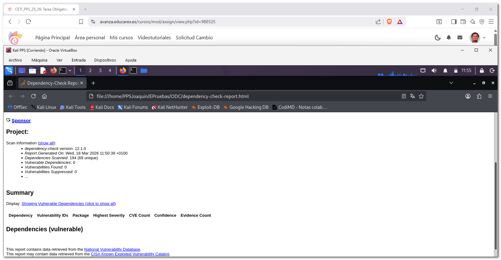

# 4. Documentación de errores en la Seguridad y componentes vulnerables

En esta actividad se analiza la presencia de **dependencias vulnerables** en un proyecto `Node.js` utilizando la herramienta **OWASP Dependency-Check**.  

Se muestra:  

- El **estado inicial del proyecto con vulnerabilidades**.
- La **detección de dependencias inseguras**.
- La **aplicación de mitigaciones**.
- Evidencias mediante capturas de pantalla.

---

## 4.1 Instalación OWASP Dependency-Check y solicitud key API NVD

A continuación muestro la instalación de la herramienta de código abierto de OWASP que permite identificar dependencias vulnerables en un proyecto al compararlas con bases de datos de vulnerabilidades conocidas, como la National Vulnerability Database (NVD) de la cual solicitaré su API key.

### Instalación OWASP Dependency-Check



---

### Solicitud key API NVD



---

## 4.2 Análisis de proyecto en Node.js

### Instalación Node.js

Para verificar vulnerabilidades en las dependencias de un proyecto basado en Node.js, nstalamos `nodejs` y `npm`:



---

### Estado inicial y vulnerabilidad

Se crea un proyecto en Node.js e instalo librerías con versiones conocidas por contener vulnerabilidades, se aprecia que se detectan en la instalación.



Al instalarlo crea un archivo `package-lock.json` con todas las dependencias que utiliza, lo modifico para que no nos aparezcan tantos resultados, lo dejo sólo con los paquetes principales:




**`package-lock.json`**

```json
{
  "name": "example-project",
  "version": "1.0.0",
  "lockfileVersion": 2,
  "requires": true,
  "dependencies": {
    "lodash": {
      "version": "4.17.15",
      "resolved": "https://registry.npmjs.org/lodash/-/lodash-4.17.15.tgz",
      "integrity": "sha512-f3139c447bc28e7a1c752e5ca705d05d5ce69a1e5ee7eb1a136406a1e4266ca9914ba277550a693ce22dd0c9e613ee31959a2e9b2d063c6d03d0c54841b340d4==",
      "dev": false
    },
    "express": {
      "version": "4.17.1",
      "resolved": "https://registry.npmjs.org/express/-/express-4.17.1.tgz",
      "integrity": "sha512-f3139c447bc28e7a1c752e5ca705d05d5ce69a1e5ee7eb1a136406a1e4266ca9914ba277550a693ce22dd0c9e613ee31959a2e9b2d063c6d03d0c54841b340d4==",
      "dev": false
    },
    "debug": {
      "version": "2.6.9",
      "resolved": "https://registry.npmjs.org/debug/-/debug-2.6.9.tgz",
      "integrity": "sha512-f3139c447bc28e7a1c752e5ca705d05d5ce69a1e5ee7eb1a136406a1e4266ca9914ba277550a693ce22dd0c9e613ee31959a2e9b2d063c6d03d0c54841b340d4==",
      "dev": false
    }
  }
}
```

Posteriormente se ejecuta la herramienta Dependency-Check que al general el archvo dependency-check-report.hmtl que inspeccionaré en el siguiente apartado.






---

### Análisis de la vulnerabilidad

El informe muestra múltiples dependencias con vulnerabilidades, por ejemplo:

lodash 4.17.15

Vulnerabilidad: Prototype Pollution

Severidad: Alta (CVSS ~7.4)

debug 2.6.9

Vulnerabilidades relacionadas con exposición de información.

Estas vulnerabilidades pueden permitir:

Ejecución de código no autorizado.

Manipulación de objetos en la aplicación.

Fugas de información sensible.
[ODC4](./images/apartado_cuatro/odc4.png)
[ODC5](./images/apartado_cuatro/odc5.png)
[ODC6](./images/apartado_cuatro/odc6.png)

---


## 4.3 Mitigación

A continuación muestro las soluciones aplicadas.

### Mitigación 1 - Actualización de dependencias




### Mitigación 2 - Auditoría y verificación de seguridad





---

