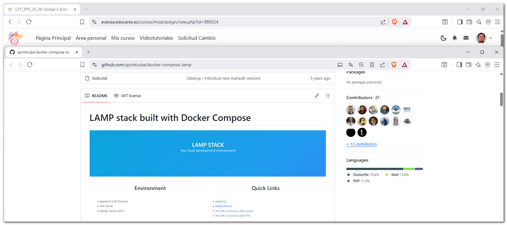
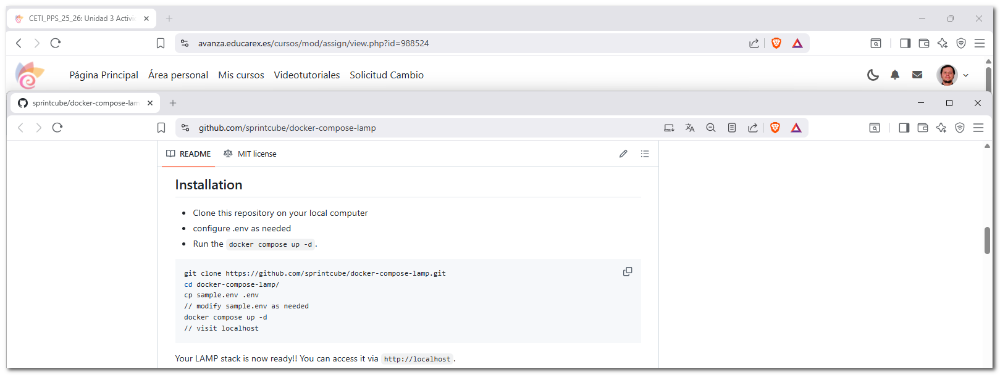
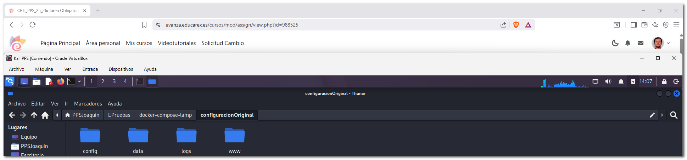
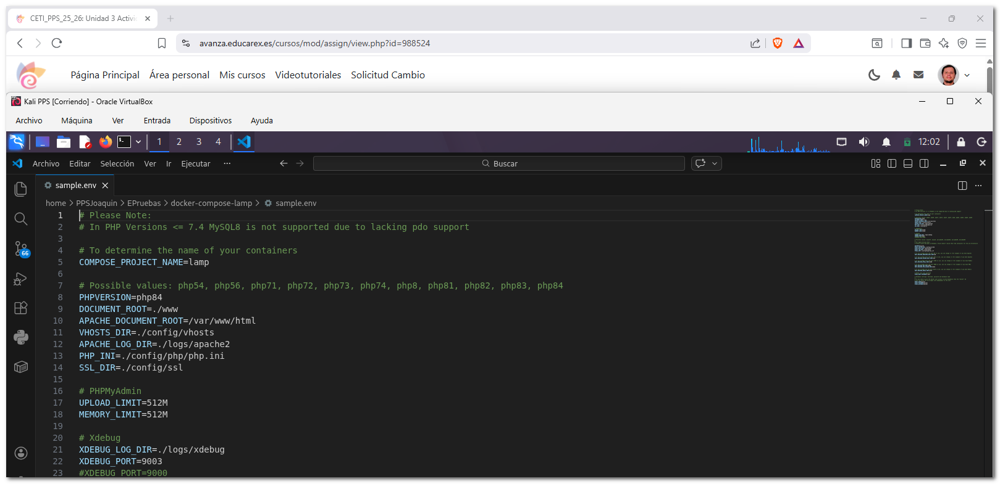
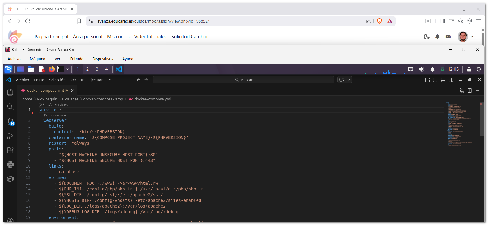
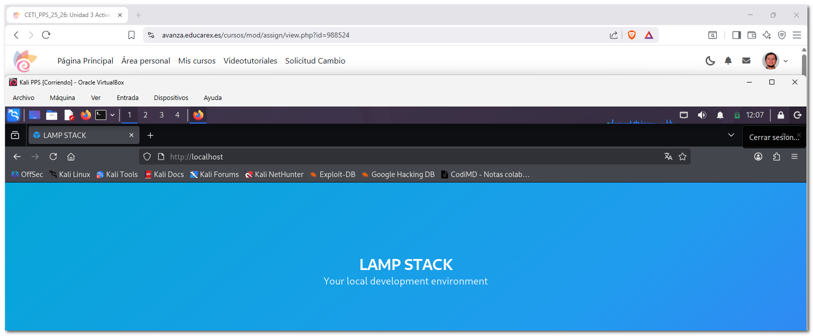
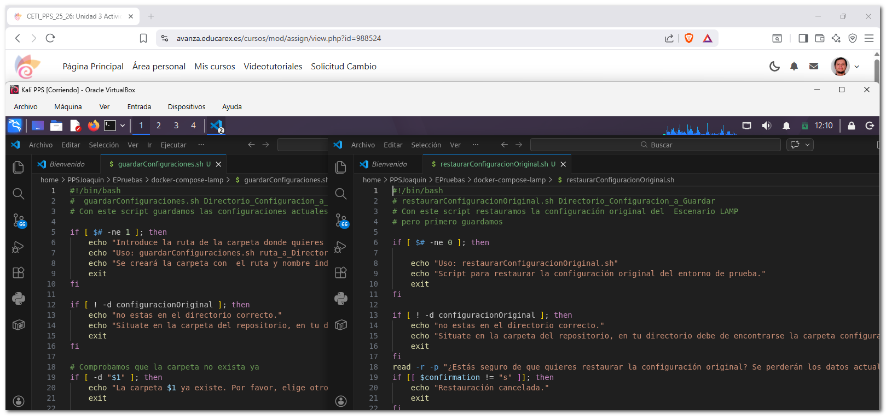
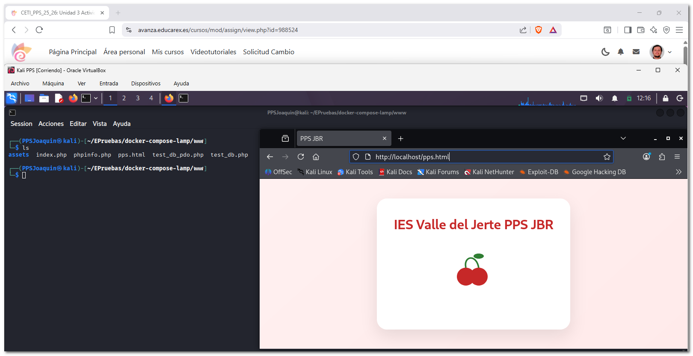
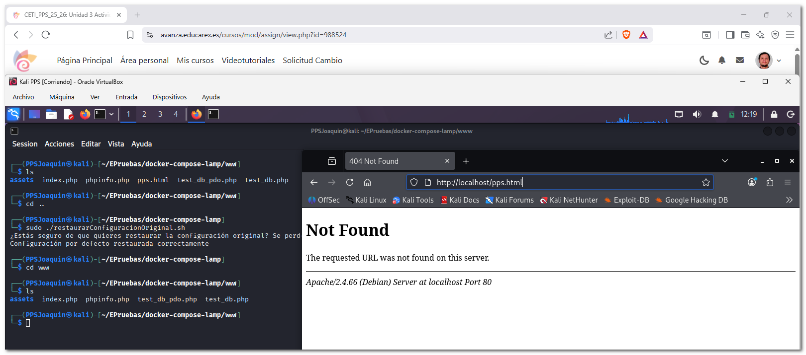

# 1. Documentación sobre la creación del entorno de Pruebas

En esta documentación se describe el proceso de **creación de un entorno de prueba**. Este entorno se utilizará posteriormente para realizar distintas actividades relacionadas con la **introducción y análisis de vulnerabilidades**, con el objetivo de aprender a detectarlas y corregirlas.

Para ello despliego un **escenario multicontenedor** utilizando Docker, que incluye los servicios necesarios para un entorno LAMP (Linux, Apache, MySQL y PHP).

-  Creo un escenario multicontenedor basasdo en LAMP que encontramos en el siguiente repositorio: (https://github.com/sprintcube/docker-compose-lamp.git).



(https://github.com/sprintcube/docker-compose-lamp.git)  

---

## 1.1 Instalación

Para realizar la instalación del entorno LAMP se siguen las instrucciones proporcionadas en el repositorio.



-  En primer lugar se crea una carpeta de trabajo y otra que me sirva de backup donde se almacenará el proyecto.



-  A continuación se muestra el contenido del archivo de configuración .env, donde se definen diferentes parámetros del entorno, como los puertos utilizados, configuraciones de PHP, acceso a la base de datos y otras variables necesarias para el funcionamiento del sistema.



**`sample.env`**
```
PHP_INI=./config/php/php.ini
SSL_DIR=./config/ssl

# PHPMyAdmin
UPLOAD_LIMIT=512M
MEMORY_LIMIT=512M

# Xdebug
XDEBUG_LOG_DIR=./logs/xdebug
XDEBUG_PORT=9003
#XDEBUG_PORT=9000

# Possible values: mysql57, mysql8, mariadb103, mariadb104, mariadb105, mariadb106
#
# For Apple Silicon User: 
# Please select Mariadb as Database. Oracle doesn't build their SQL Containers for the arm Architecure

DATABASE=mysql8
MYSQL_INITDB_DIR=./config/initdb
MYSQL_DATA_DIR=./data/mysql
MYSQL_LOG_DIR=./logs/mysql
MYSQL_CNF=./config/mysql/my.cnf

# If you already have the port 80 in use, you can change it (for example if you have Apache)
HOST_MACHINE_UNSECURE_HOST_PORT=80

# If you already have the port 443 in use, you can change it (for example if you have Apache)
HOST_MACHINE_SECURE_HOST_PORT=443

# If you already have the port 3306 in use, you can change it (for example if you have MySQL)
HOST_MACHINE_MYSQL_PORT=3306

# If you already have the port 8080 in use, you can change it (for example if you have PMA)
HOST_MACHINE_PMA_PORT=8080
HOST_MACHINE_PMA_SECURE_PORT=8443

# If you already has the port 6379 in use, you can change it (for example if you have Redis)
HOST_MACHINE_REDIS_PORT=6379

# MySQL root user password
MYSQL_ROOT_PASSWORD=tiger

# Database settings: Username, password and database name
#
# If you need to give the docker user access to more databases than the "docker" db 
# you can grant the privileges with phpmyadmin to the user.
MYSQL_USER=docker
MYSQL_PASSWORD=docker
MYSQL_DATABASE=docker
```

-  Muestra de mi fichero docker





**`docker-compose.yml`**
```
services:
  webserver:
    build:
      context: ./bin/${PHPVERSION}
    container_name: "${COMPOSE_PROJECT_NAME}-${PHPVERSION}"
    restart: "always"
    ports:
      - "${HOST_MACHINE_UNSECURE_HOST_PORT}:80"
      - "${HOST_MACHINE_SECURE_HOST_PORT}:443"
    links:
      - database
    volumes:
      - ${DOCUMENT_ROOT-./www}:/var/www/html:rw
      - ${PHP_INI-./config/php/php.ini}:/usr/local/etc/php/php.ini
      - ${SSL_DIR-./config/ssl}:/etc/apache2/ssl/
      - ${VHOSTS_DIR-./config/vhosts}:/etc/apache2/sites-enabled
      - ${LOG_DIR-./logs/apache2}:/var/log/apache2
      - ${XDEBUG_LOG_DIR-./logs/xdebug}:/var/log/xdebug
    environment:
      APACHE_DOCUMENT_ROOT: ${APACHE_DOCUMENT_ROOT-/var/www/html}
      PMA_PORT: ${HOST_MACHINE_PMA_PORT}
      MYSQL_ROOT_PASSWORD: ${MYSQL_ROOT_PASSWORD}
      MYSQL_USER: ${MYSQL_USER}
      MYSQL_PASSWORD: ${MYSQL_PASSWORD}
      MYSQL_DATABASE: ${MYSQL_DATABASE}
      HOST_MACHINE_MYSQL_PORT: ${HOST_MACHINE_MYSQL_PORT}
      XDEBUG_CONFIG: "client_host=host.docker.internal remote_port=${XDEBUG_PORT}"
    extra_hosts:
      - "host.docker.internal:host-gateway"
  database:
    build:
      context: "./bin/${DATABASE}"
    container_name: "${COMPOSE_PROJECT_NAME}-${DATABASE}"
    restart: "always"
    ports:
      - "127.0.0.1:${HOST_MACHINE_MYSQL_PORT}:3306"
    volumes:
      - ${MYSQL_INITDB_DIR-./config/initdb}:/docker-entrypoint-initdb.d
      - ${MYSQL_DATA_DIR-./data/mysql}:/var/lib/mysql
      - ${MYSQL_LOG_DIR-./logs/mysql}:/var/log/mysql
      - ${MYSQL_CNF-./config/mysql/my.cnf}:/etc/my.cnf
    environment:
      MYSQL_ROOT_PASSWORD: ${MYSQL_ROOT_PASSWORD}
      MYSQL_DATABASE: ${MYSQL_DATABASE}
      MYSQL_USER: ${MYSQL_USER}
      MYSQL_PASSWORD: ${MYSQL_PASSWORD}
  phpmyadmin:
    image: phpmyadmin
    container_name: "${COMPOSE_PROJECT_NAME}-phpmyadmin"
    links:
      - database
    environment:
      PMA_HOST: database
      PMA_PORT: 3306
      PMA_USER: root
      PMA_PASSWORD: ${MYSQL_ROOT_PASSWORD}
      MYSQL_ROOT_PASSWORD: ${MYSQL_ROOT_PASSWORD}
      MYSQL_USER: ${MYSQL_USER}
      MYSQL_PASSWORD: ${MYSQL_PASSWORD}
      UPLOAD_LIMIT: ${UPLOAD_LIMIT}
      MEMORY_LIMIT: ${MEMORY_LIMIT}
    ports:
      - "${HOST_MACHINE_PMA_PORT}:80"
      - "${HOST_MACHINE_PMA_SECURE_PORT}:443"
    volumes:
      - /sessions
      - ${PHP_INI-./config/php/php.ini}:/usr/local/etc/php/conf.d/php-phpmyadmin.ini
  redis:
    container_name: "${COMPOSE_PROJECT_NAME}-redis"
    image: redis:latest
    ports:
      - "127.0.0.1:${HOST_MACHINE_REDIS_PORT}:6379"
```



---

## 1.2 Scripts



**`guardarConfiguraciones.sh`**
```
#!/bin/bash
#  guardarConfiguraciones.sh Directorio_Configuracion_a_Guardar
# Con este script guardamos las configuraciones actuales del  Escenario LAMP

if [ $# -ne 1 ]; then
    echo "Introduce la ruta de la carpeta donde quieres guardar la configuración existente"
    echo "Uso: guardarConfiguraciones.sh ruta_a_Directorio_Configuracion"
    echo "Se creará la carpeta con  el ruta y nombre indicados."
    exit
fi

if [ ! -d configuracionOriginal ]; then
    echo "no estas en el directorio correcto."
    echo "Situate en la carpeta del repositorio, en tu directorio debe de encontrarse la carpeta configuracionOriginal"
    exit
fi

# Comprobamos que la carpeta no exista ya
if [ -d "$1" ]; then
    echo "La carpeta $1 ya existe. Por favor, elige otro nombre o elimina la carpeta existente."
    exit

fi
# solicitamos confirmación al usuario sobre la acción a realizar
read -r -p "¿Estás seguro de que quieres guardar la configuración actual? (s/n): " confirmation
case "$confirmation" in
    [sS])
        echo "Guardando configuración..."
        ;;
    [nN])
        echo "Acción de guardar datos cancelada."
        exit 0
        ;;
    *)
        echo "Opción no válida. Acción cancelada."
        exit 1
        ;;
esac

# Creamos la carpeta especificada y copiamos los datos y configuraciones indicados en dicha carpeta.
mkdir -p "$1"
echo "Configuración guardada correctamente en la carpeta $1"
```
**`restaurarConfiguracionOriginal.sh`**
```
#!/bin/bash
# restaurarConfiguracionOriginal.sh Directorio_Configuracion_a_Guardar
# Con este script restauramos la configuración original del  Escenario LAMP
# pero primero guardamos

if [ $# -ne 0 ]; then

    echo "Uso: restaurarConfiguracionOriginal.sh"
    echo "Script para restaurar la configuración original del entorno de prueba."
    exit
fi

if [ ! -d configuracionOriginal ]; then
    echo "no estas en el directorio correcto."
    echo "Situate en la carpeta del repositorio, en tu directorio debe de encontrarse la carpeta configuracionOriginal"
    exit
fi
read -r -p "¿Estás seguro de que quieres restaurar la configuración original? Se perderán los datos actuales. (s/n): " confirmation
if [[ $confirmation != "s" ]]; then
    echo "Restauración cancelada."
    exit
fi
# Borramos los datos y configuraciones existentes
rm -rf config/* data/* logs/* www/* 
# Copiamos los datos y configuraciones por defecto
cp -rp configuracionOriginal/config configuracionOriginal/data configuracionOriginal/logs configuracionOriginal/www ./
echo "Configuración por defecto restaurada correctamente"
```
---

## 1.3 Prueba funcionamiento scripts




---
